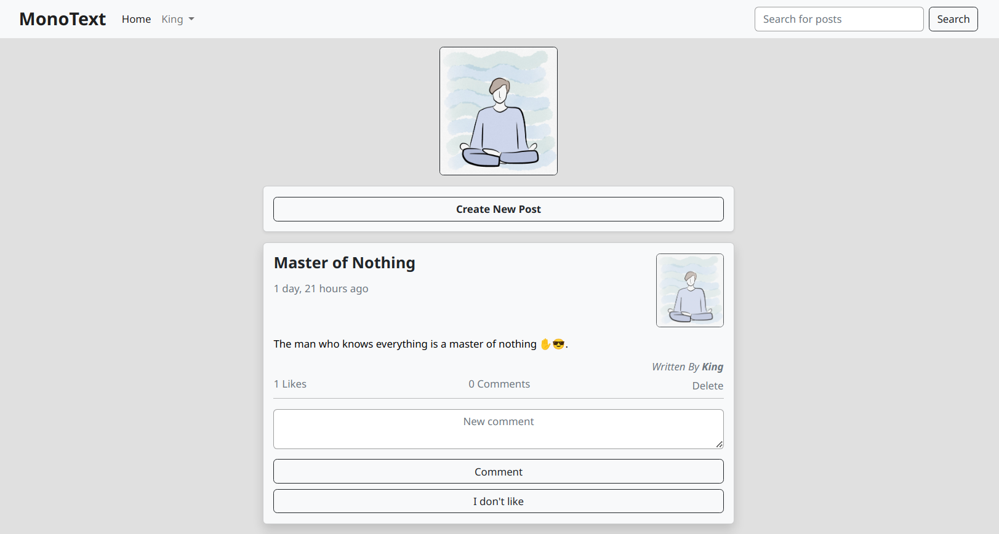
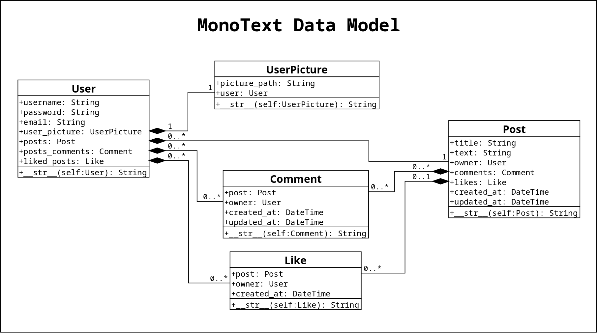

# MonoText

## Description

A simple blog that just has text posts and some basic features.

You can find it at https://husseinkandil.pythonanywhere.com/.

#### Main Page Screenshot

#### Data Model Diagram

This site is my final project for ["Django for Everybody"](https://www.dj4e.com/).

I tried to focus on practicing Django features while keeping the overall site, and any other technologies that i used, as simple as possible.

Using **MonoText** (without logged-in account) you can only see posts and search for a post.

Using **MonoText** (with logged-in account) you can like/comment on any post, create new posts, have/change his own profile picture and have a personal profile page that shows all of his own posts.

- **Important Notes**:
  - Currently, there is no legal way to create a new account on this site, (that's because i am not planning to maintain or update it anymore).
  - There are 2 accounts available to test the site thoroughly and their login information is already fulfilled on the login page, so anyone can just press login on the chosen account.

I spent about two weeks working on this project and learning
some extra stuff to fill in the gaps and solve some of the problems that i faced. And although the site is not fully featured i am very proud of it and looking for more to learn and build.
